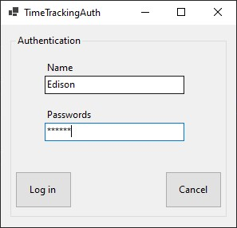

# Time Tracking App

This repository presents a client-server web application that simulates the 
behavior of a time tracking application for the employees in a company. 
The application features the use of a database to store the relevant information
regarding employees and worked hours. 

This application is designed to have a distributed model of operation, there is a client side desktop 
application build so that employees can register their worked hours every day, then in addition to that there is a web user interface used for 
administration. Both of those client sides are managed by a server that implements the core logic of the application.

## Application structure

### 1. Core Logic of the application
The backend that implements all the specified requirements of the 
application was developed using ***Java Spring Framework***. The database used for this application was implemented using ***MySql***.

### 2. Administrator user interface
To allow for an administrator to manage his employees a web user interface was implemented using ***React*** library. To enrich the 
user interface while maintaining the flexibility over the look and feel ***pure CSS*** was used only. The administrator has the possibility to manage
employees and to see statistics regarding the number of worked hours. 

### 3. Employee user interface
The application was thought so that each employee has a desktop application 
in which they can record their working time every day of work. This part of the application was implemented using ***windows forms***. 

One employee must enter his credentials to be able to access the application, after that he can submit his number of worked hour in a specific data without overwriting.

